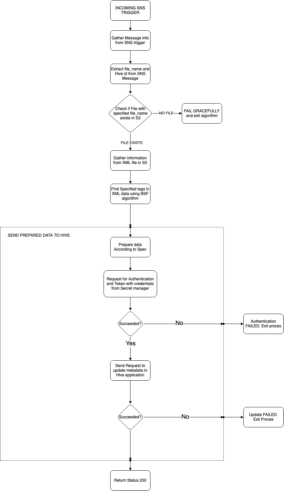

# new-ppe-sh-woody-metadata-lambda

This project is a representation of Lambda function used to gather metadata from incoming SNS trigger.
Base purpose of this function is to update file in Hive application with metadata gather from S3 bucket.

## Installation

For the installation you only need to only add xmltodict library in  AWS lambda function (that does not refer to tests witch run
locally with several others libraries).

## Usage

Lambda function is design to run in event of incoming SNS trigger. Algorithm is defined as follows:

